 

	<h1 align="center"> Understanding the Relation between Noise and Bias  
	in Annotated Datasets </h1>

## Motivation
- **Bias in Annotation**: Annotator differences in <em>subjective tasks</em> introduce <em>bias in their annotations</em>, especially in sensitive domains like hate speech recognition, stemming from diverse backgrounds and perspectives.
- **Misinterpretation of Bias as Noise**: Minority votes are often considered <em>outliers</em> by models. This causes models to perceive them as noise, leading to biased predictions favoring <em>majority vote</em>.
- In this project, we'll explore if <em>perspectivist classification models</em> effectively utilize valuable insights from instances labeled as noisy by noise-detection techniques.

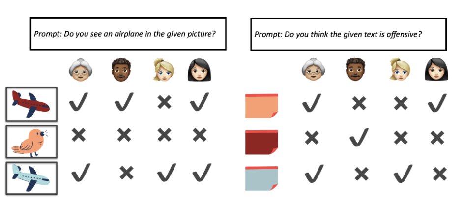

## Problem Statement
In the evolving landscape of machine learning, the reliability and fairness of models hinge on the quality of annotated data. However, the presence of bias, particularly in subjective tasks, has become a critical concern. This is especially prominent in sensitive domains like hate speech recognition, where annotators, stemming from diverse backgrounds and perspectives, might introduce bias in their annotations.

## Datasets

<table>  
  <tr>
    <td rowspan="2"></td>
    <th colspan="3" scope="colgroup">Toxicity and Hate Speech</th>
  </tr>
  <tr>
    <th scope="col">SBIC [1]</th>
    <th scope="col">Kennedy [2]</th>
    <th scope="col">Agree to Disagree [3]</th>
  </tr>
  <tr>
    <td style="text-align: left"><b># Annotators</b></td>
    <td style="text-align: center">307</td>
    <td style="text-align: center">7,912</td>
    <td style="text-align: center">819</td>
  </tr>
  <tr>
    <td style="text-align: left"><b># Annotations per annotator</b></td>
    <td style="text-align: center">479±829.6</td>
    <td style="text-align: center">17.1±3.8</td>
    <td style="text-align: center">63.7±139</td>
  </tr>
  <tr>
    <td style="text-align: left"><b># Unique texts</b></td>
    <td style="text-align: center">45318</td>
    <td style="text-align: center">39,565</td>
    <td style="text-align: center">10,440</td>
  </tr>
  <tr>
    <td style="text-align: left"><b># Annotations per text</b></td>
    <td style="text-align: center">3.2±1.2</td>
    <td style="text-align: center">2.3±1.0</td>
    <td style="text-align: center">5</td>
  </tr>
  <tr>
    <td style="text-align: left"><b># Labels</b></td>
    <td style="text-align: center">2</td>
    <td style="text-align: center">3</td>
    <td style="text-align: center">2</td>
  </tr>
</table>

## Methodology
<ul>
	<li> <b>Data Cartography</b> summarizes training dynamics for all samples as: </li>
		<ul>
  			<li> <b>Confidence</b>: Mean of probabilities for gold label across epochs.</li>
  			<li> <b>Variability</b>: Standard Deviation of probabilities for gold label across epochs.</li>
		</ul>
	<li> <b>Multi annotator models</b> leverages the diverse viewpoints brought by different annotators. They learn to <em>predict the labels each annotator would provide</em> for each instance in the dataset. These models get an instance id and an annotator id as input. </li>
</ul>

### MODEL AND PERFORMANCE

> **Model**

Trained 2 models for each dataset

<table>  
  <tr>
    <td style="text-align: left"><b>Majority Label Model</b></td>
    <td style="text-align: left"><b>Multi Annotator Model</b></td>
  </tr>
  <tr>
    <td style="text-align: left"> <b>Model</b> - Roberta-Base   <b>Epochs</b> - 5   <b>Learning Rate</b> - 5e-5   <b>Batch Size</b> - 32   <b>Max Sentence Length</b> - 256 </td>
    <td style="text-align: left"> <b>Model</b> - DISCO   <b>Epochs</b> - 5 </td>
  </tr>
</table>

> **Performance**

<table>  
  <tr>
    <td style="text-align: left"><b>Dataset</b></td>
    <td style="text-align: left"><b>F1 Score (majority)</b></td>
    <td style="text-align: left"><b>F1 Score (multi-annotator)</b></td>
  </tr>
  <tr>
    <td style="text-align: left">Agree to Disagree</td>
    <td style="text-align: center">0.81</td>
    <td style="text-align: center"> </td>
  </tr>
  <tr>
    <td style="text-align: left">Kennedy</td>
    <td style="text-align: center">0.68</td>
    <td style="text-align: center"> </td>
  </tr>
  <tr>
    <td style="text-align: left">SBIC</td>
    <td style="text-align: center">0.72</td>
    <td style="text-align: center"> </td>
  </tr>
</table>

## Results

> **DATASET CARTOGRAPHY**

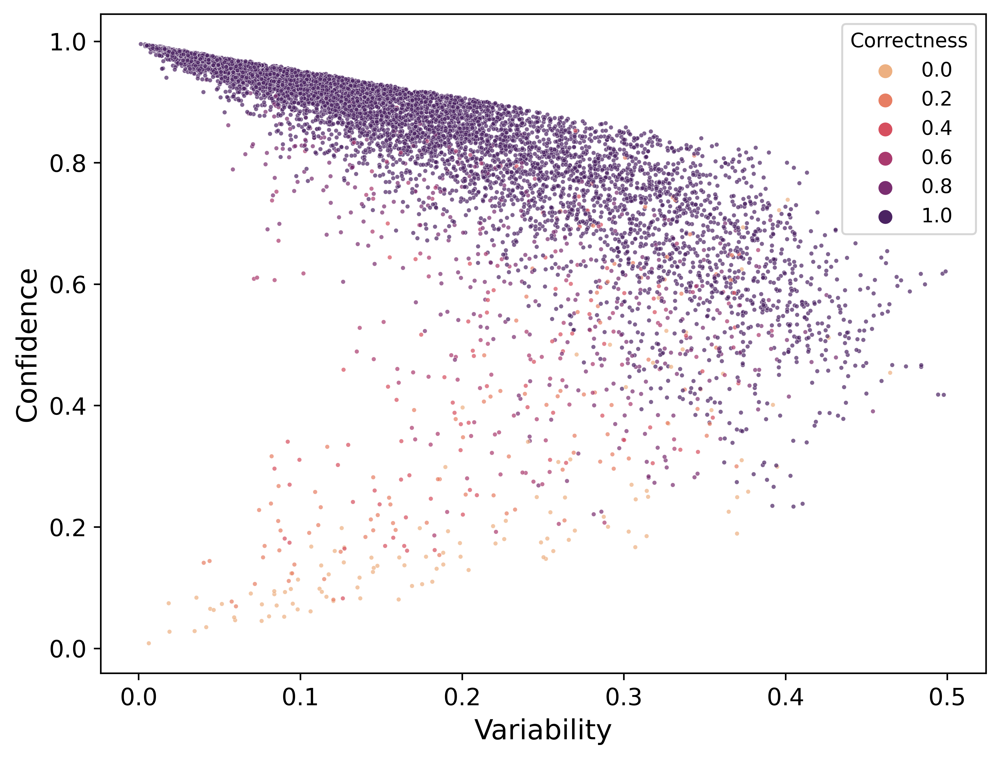

### AGREE TO DISAGREE
> **MAJORITY VOTE LABEL**

> **MULTI ANNOTATOR**

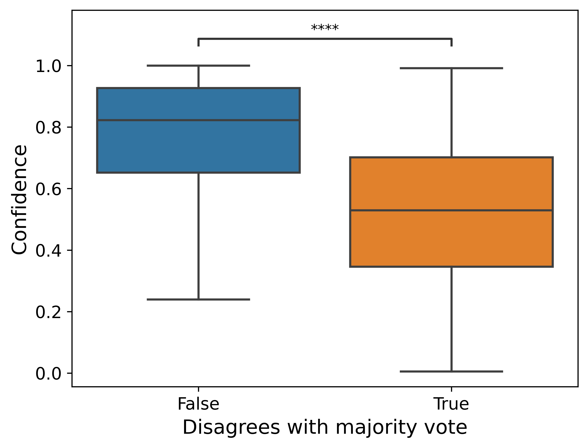
 &nbsp;&nbsp;&nbsp;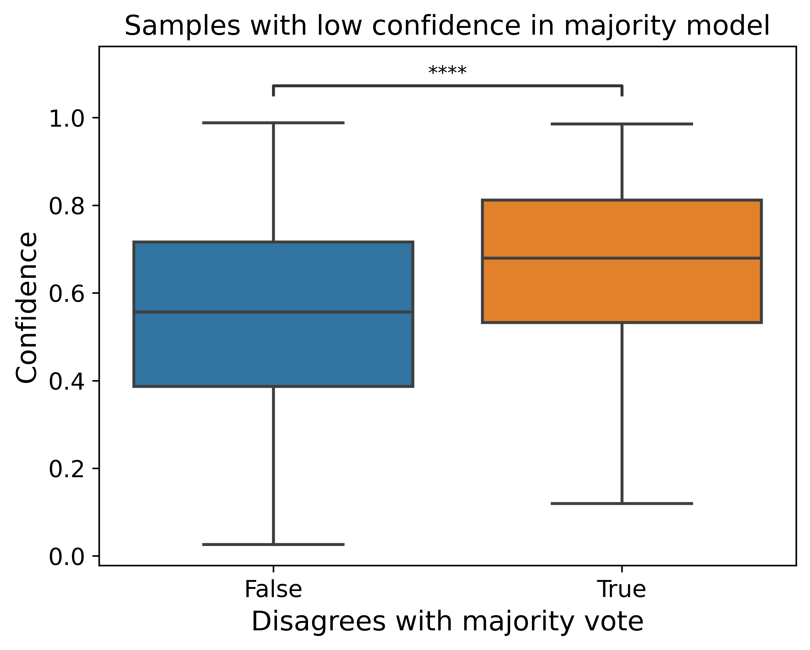
 &nbsp;&nbsp;&nbsp;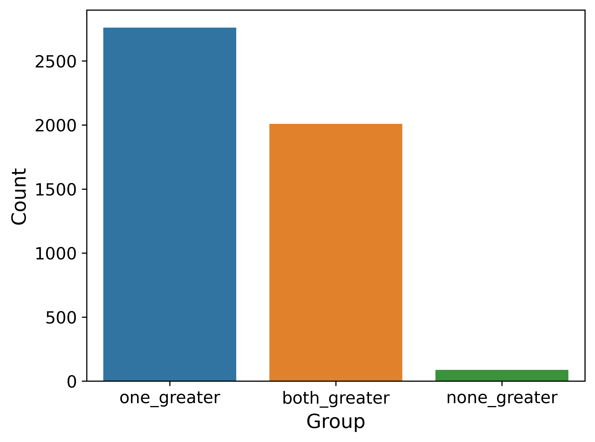

### KENNEDY
> **MAJORITY VOTE LABEL**

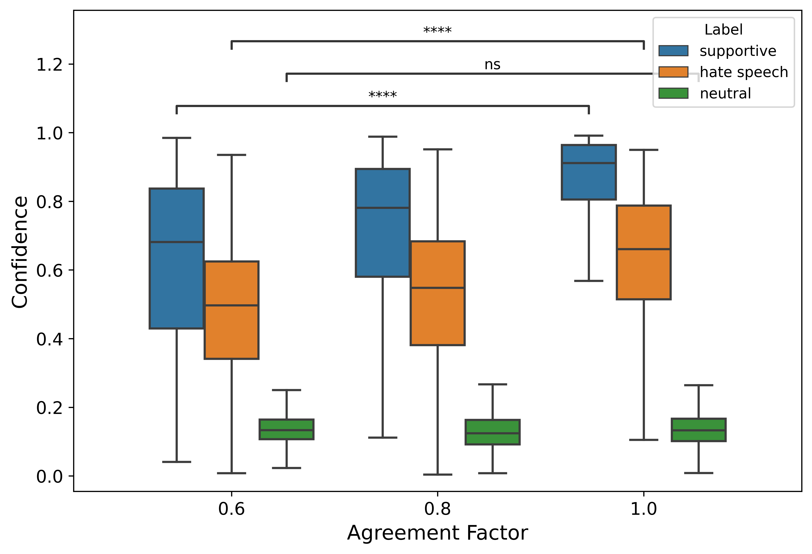
 
> **MULTI ANNOTATOR**

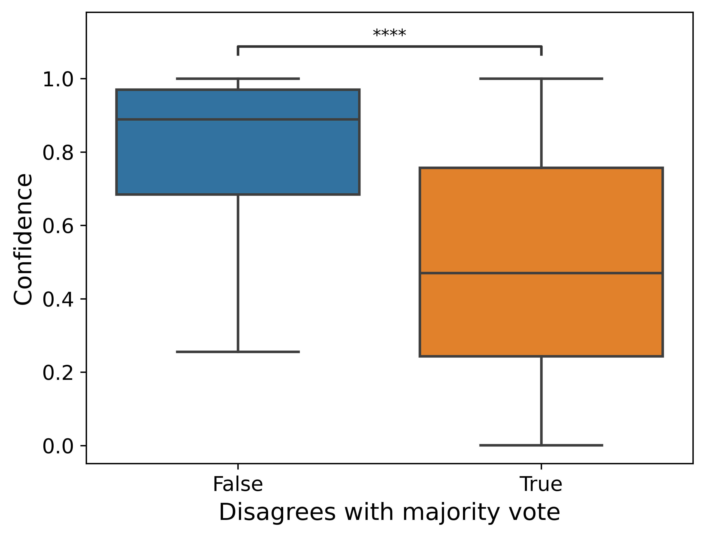
 &nbsp;&nbsp;&nbsp;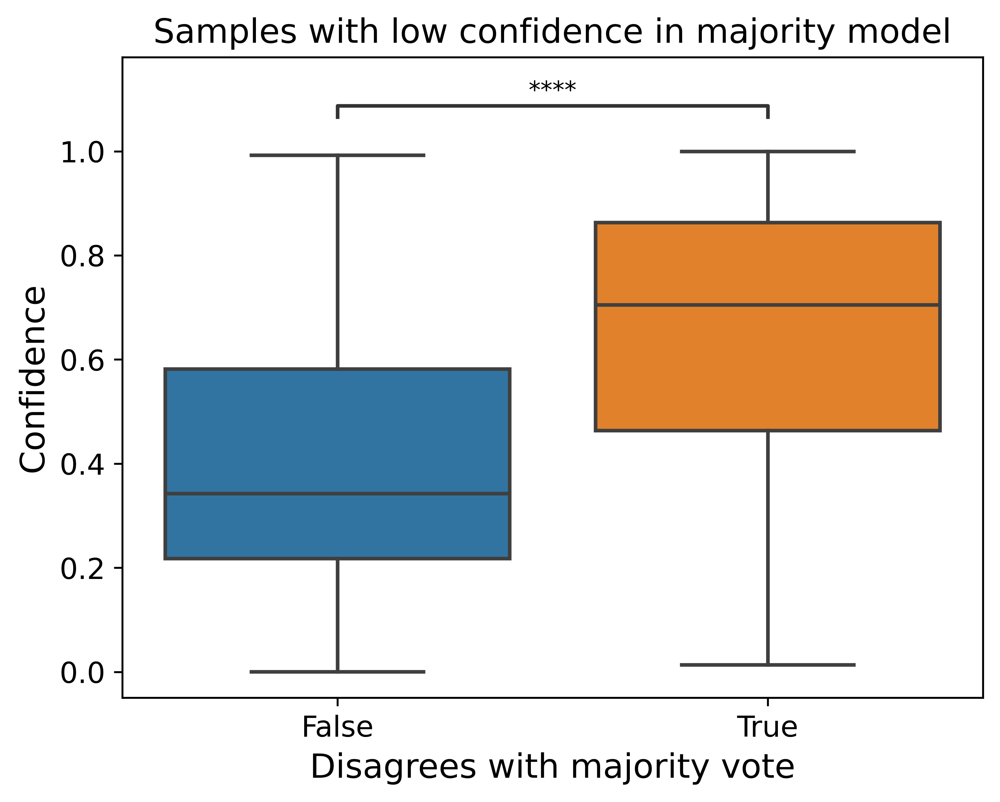
 &nbsp;&nbsp;&nbsp;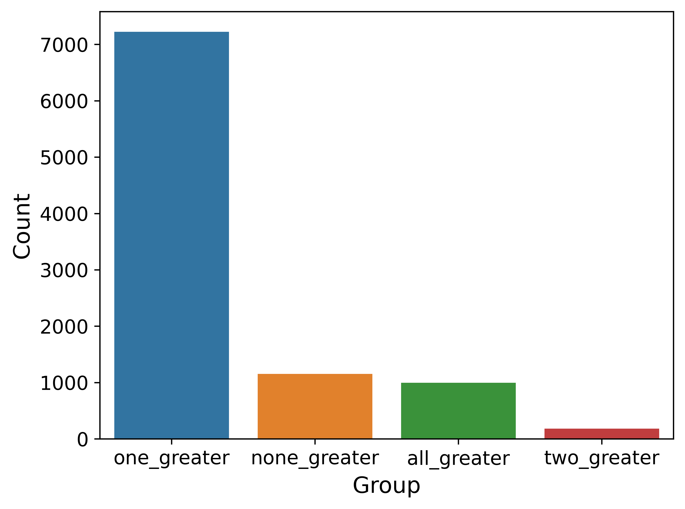

### SBIC
> **MAJORITY VOTE LABEL**

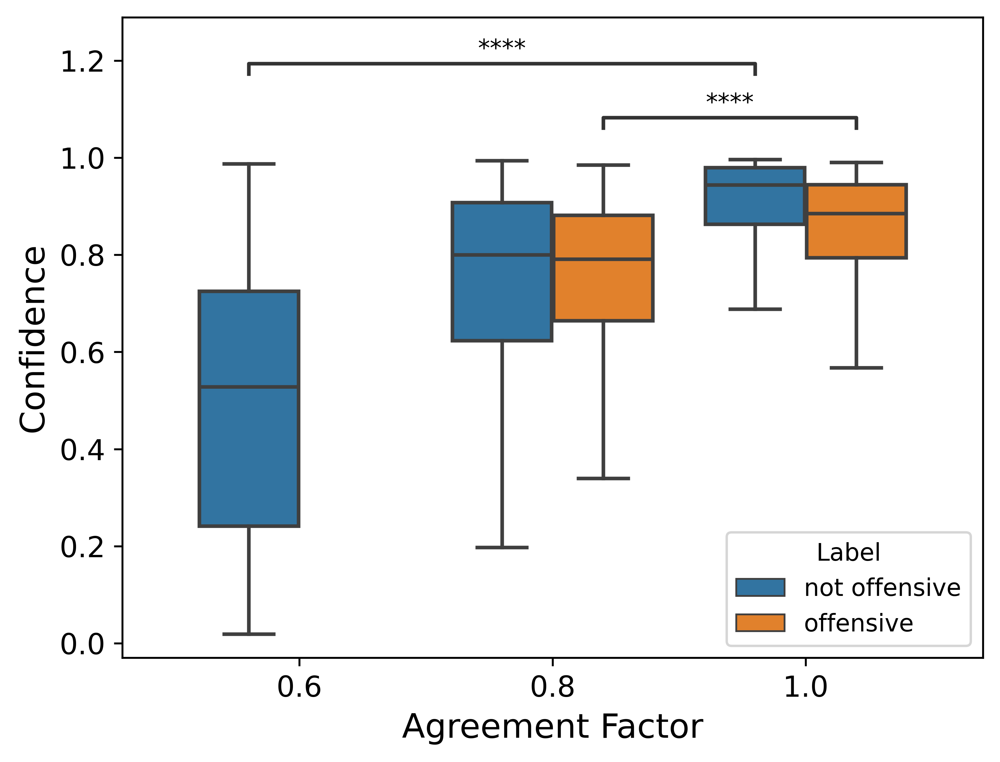

> **MULTI ANNOTATOR**

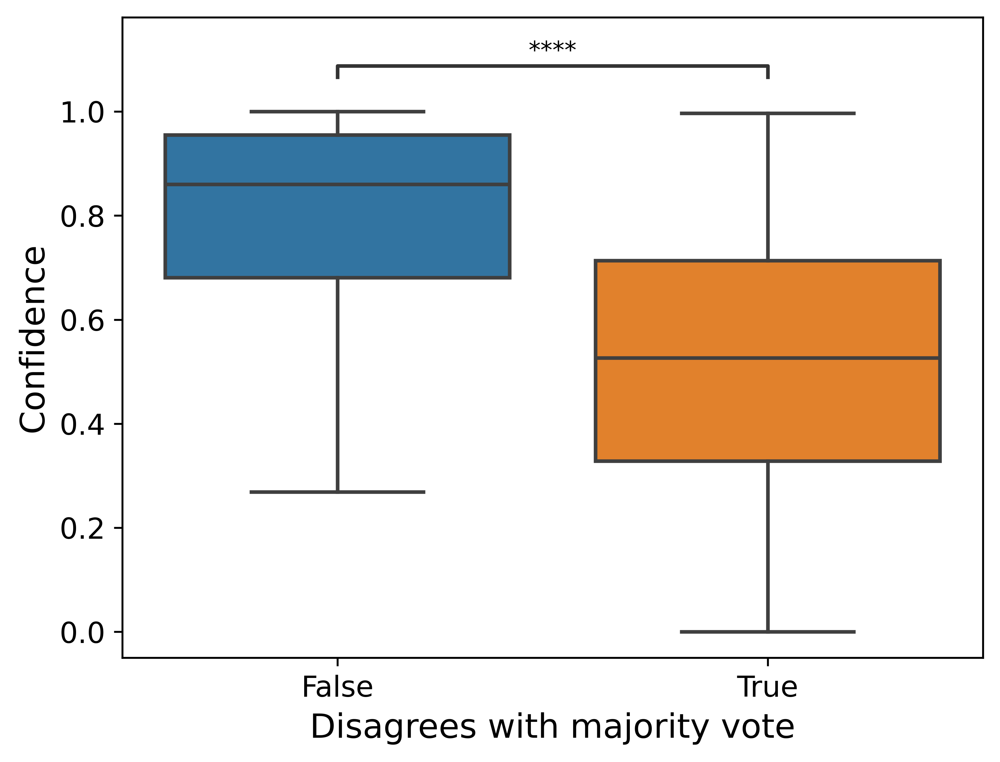
 &nbsp;&nbsp;&nbsp;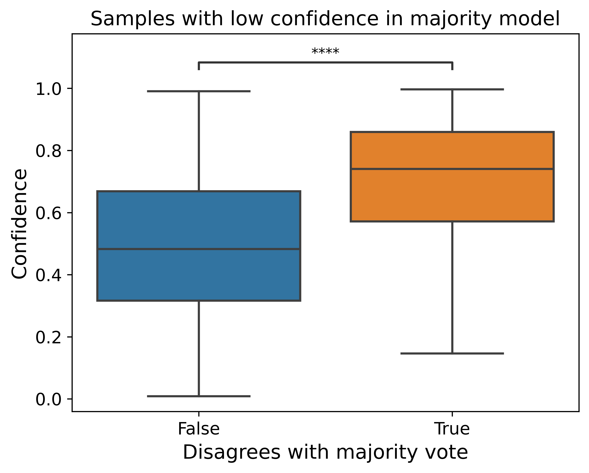
 &nbsp;&nbsp;&nbsp;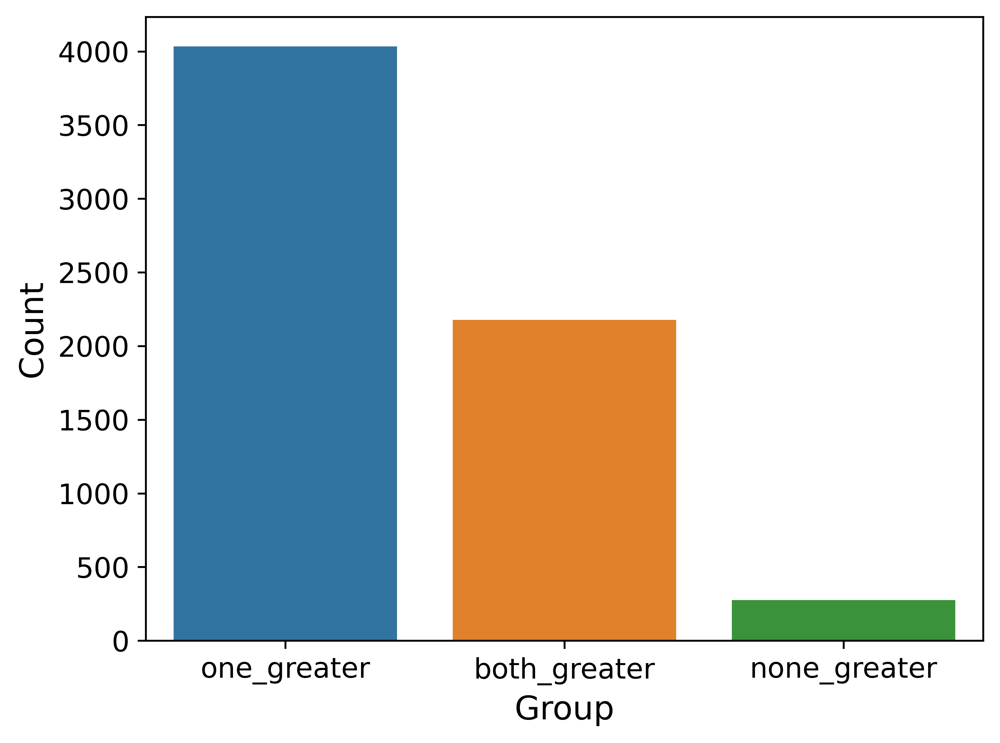

## Analysis

<b>High Confidence in Majority model and Low Confidence in Multi-Annotator model</b>

<table>  
  <tr>
    <td style="text-align: left"><b>Text</b></td>
    <td style="text-align: left"><b>Annotation</b></td>
  </tr>
  <tr>
    <td style="text-align: left">I thought you were going to win this in a landslide</td>
    <td style="text-align: left">Offensive</td>
  </tr>
  <tr>
    <td style="text-align: left">crossing my fingers for you from Germany. Even though I am not an American.</td>
    <td style="text-align: left">Offensive</td>
  </tr>
  <tr>
    <td style="text-align: left">boy F**K you</td>
    <td style="text-align: left">Not Offensive</td>
  </tr>
  <tr>
    <td style="text-align: left">Fragility at its finest</td>
    <td style="text-align: left">Offensive</td>
  </tr>
</table>

## Findings

Focusing on the correlation between human agreement and the model’s confidence over the instances we observe:
- We see significant correlation between agreement between annotators and model confidence in all the datasets, with the confidence decreasing with more disagreement between the annotators on the label.

## References

[1] [Social Bias Frames: Reasoning about Social and Power Implications of Language](https://aclanthology.org/2020.acl-main.486) (Sap et al., ACL 2020)

[2] [Constructing interval variables via faceted Rasch measurement and multitask deep learning: a hate speech application](https://arxiv.org/abs/2009.10277) (Kennedy et al., 2020)

[3] [Agreeing to Disagree: Annotating Offensive Language Datasets with Annotators’ Disagreement](https://aclanthology.org/2021.emnlp-main.822) (Leonardelli et al., EMNLP 2021)

[4] [SemEval-2018 Task 1: Affect in Tweets](https://aclanthology.org/S18-1001) (Mohammad et al., SemEval 2018)

[5] [Dataset Cartography: Mapping and Diagnosing Datasets with Training Dynamics](https://aclanthology.org/2020.emnlp-main.746) (Swayamdipta et al., EMNLP 2020)

[6] [Dealing with Disagreements: Looking Beyond the Majority Vote in Subjective Annotations](https://aclanthology.org/2022.tacl-1.6) (Mostafazadeh Davani et al., TACL 2022)

[7] [Annotators with Attitudes: How Annotator Beliefs And Identities Bias Toxic Language Detection](https://aclanthology.org/2022.naacl-main.431) (Sap et al., NAACL 2022)

## About the Team

<table>
<tr align="center">
	
<td>
Abhishek Anand

 MS in Computer Science 

</td>

<td>
Anweasha Saha

 MS in Computer Science 

</td>

<td>
Prathyusha Naresh Kumar

 MS in Computer Science 

</td>

<td>
Negar Mokhberian

 PhD in Computer Science 

</td>

<td>
Ashwin Rao

 PhD in Computer Science 

</td>

<td>
Zihao He

 PhD in Computer Science 

</td>

</tr>
  </table>
